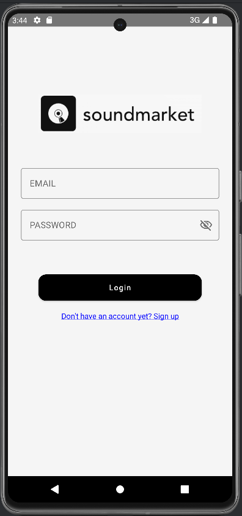
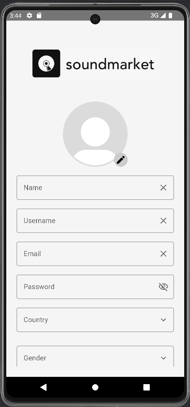
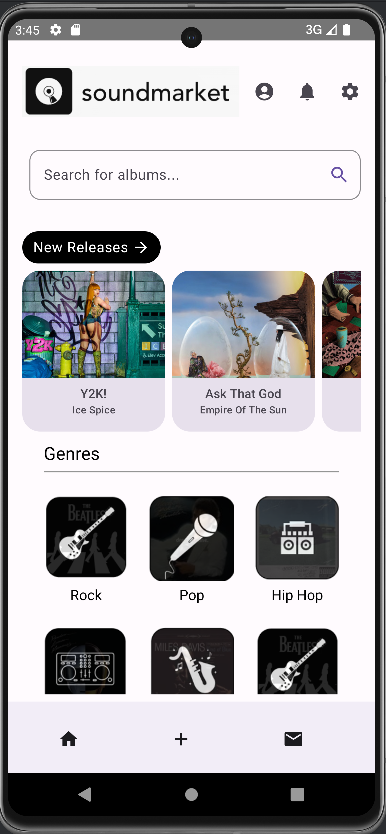
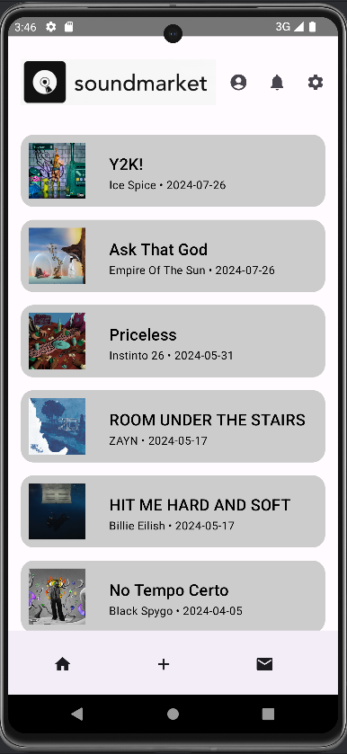
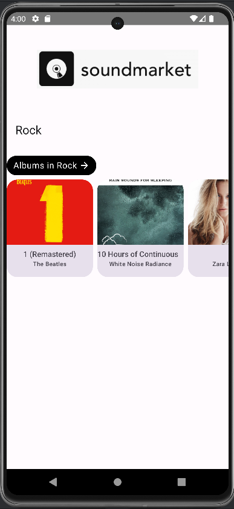
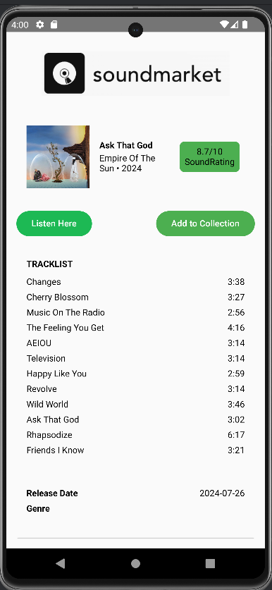
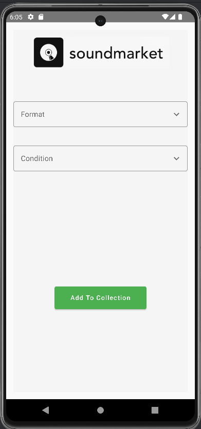
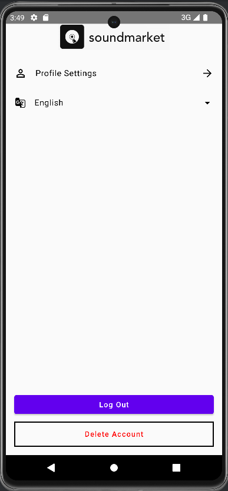

# Manual do Utilizador
## índice
 * Página de login 
 * Registo
 * Home Page
 * Novos lançamentos
 * Página do gênero
 * Álbum
 * Adicionar à coleção
 * Perfil
 * Definições
### Página de login 

É esta a página que vai aparecer quando o utilizador entrar na aplicação. Aqui há duas opções, se for a primeira vez a usar a aplicação carrega para criar conta, se já tiver conta criada, só vai ter te introduzir os dados para entrar na aplicação

### Registo

Caso o utilizador tenha carregado no botão para criar conta será redirecionado para aqui. Vai ter de intrduzir todas as informações e quando terminar carrega no botão para criar conta, que redirecionará o utilizador para a página do login e terá só de fazer o login.

### Página Inicial

Após fazer o login o utilizador vai ficar a ver está página, aqui terá várias opções do que quer fazer. Para começar, no topo do ecrã terá três botões para carregar, que levam o utilizador para o seu perfil, as notificações e as defenições respetivamente. Por baixo irá encontrar uma barra de pesquisa onde poderá procurar os álbuns que deseja encontrar. No carrossel o utilizador tem duas opções, ou carrega no botão para levar a uma página que mostra todas os novos lançamentos, ou pode apenas fazer scroll para o lado para ver alguns dos mais recentes lançamentos, se carregar em algum desses álbuns é redirecionado para outra página com os detalhes dos álbuns. Irá ainda encontrar uma secção que divide os álbuns por gênero. Por fim no fim da página irá encontrar mais três botões que pode carregar, o primeiro levando o utilizador de volta para a página inicial, o segundo leva-o para uma página onde pode colocar os seus álbuns à venda e o último leva o utilizador para uma página onde pode ver as mensagens que trocou com os outros utilizadores
 
### Novos Lançamentos

Ao carregar no botão do carrossel dos novos lançamentos o utilizador é levado para esta página, onde encontra todos os novos lançamentos e aqui pode voltar para trás ou carregar num albúm para ver os seus detalhes.

### Página do gênero

Nesta página o utilizador encontra um carrossel semelhante ao da págna inicial, a diferença é que nesta página o carrossel tem os álbuns filtrados por gênero, as outras funcionalidades são iguais ao carrossel da página inicial

### Álbum 

Quando carregar num álbum o utilizador será redirecionado para esta página, onde mostra a capa do álbum, o artista e o ano de lançamendo do álbum. Ao lado o utilizador ainda pode encontrar o SoundRating. Por baixo há dois botões, o da esquerda leva para o álbum no Spotify onde o utilizador pode ouvir o álbum, e o botão da direita leva para a página onde é possível adicionar o álbum à coleção. No centro do ecrã irá estar sempre a lista de músicas que estão presentes no álbum e por baixo estará a data de lançamento e o gênero do álbum. Por fim no final do ecrã ainda existe um botão que diz a quantidade de copias que estão à venda e ao ser pressionado leva para uma página onde mostra todas as listagens desse álbum

### Adicionar à coleção

Se o utilizador carregar no botão que diz "Add To Collection" será levado para esta página onde poderá escolher o formato e a condição do seu álbum. Depois de escolher, ele carrega no botão verde e o álbum é adicionado à sua coleção
### Perfil

Se na página inicial o utilizador carregar no primeiro ícone no canto superior direito ele será redirecionado para esta página. Aqui estarão para ver as informações do utilizador, bem como os álbuns que ele tem na sua coleção, como nos outros carrosséis se carregar no botão será levado para uma página como a dos novos lançamentos onde estarão todos os álbuns que estão na sua coleção

### Definições 

Para chegar a esta página o utilizador terá de ter carregado no ícone com uma engrenagem na página inicial. Quando estiver aqui terá todas estas opções e na parte inferior do ecrã irá encontrar dois botões, um que permite ao utilizador sair da sua conta e voltar para a página do login e outro botão que irá apagar a conta do utilizador 
