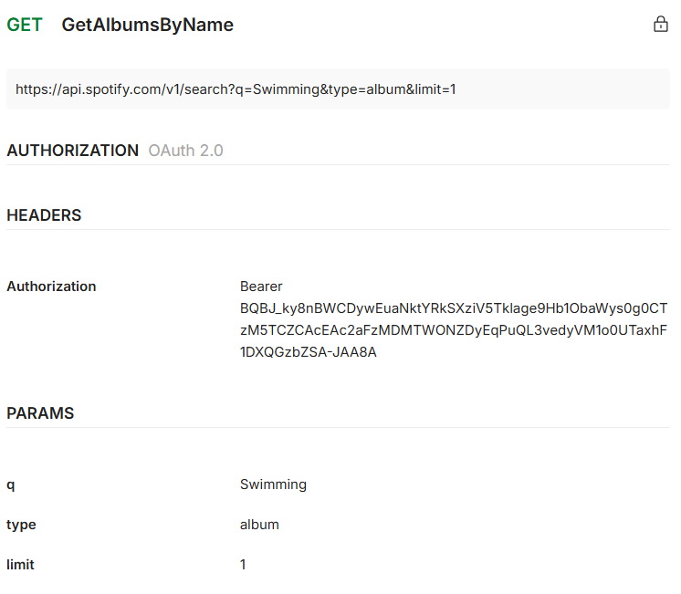
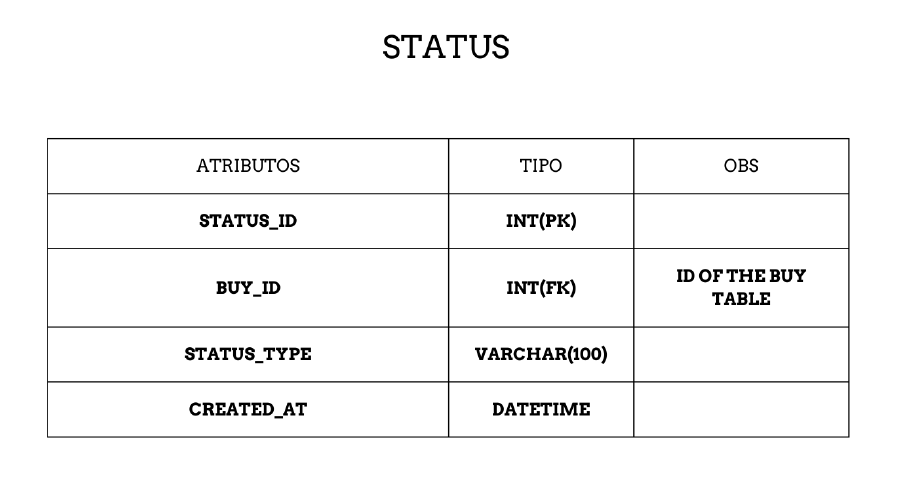

# Relatório do Projeto
### Projeto de Desenvolvimento Móvel

Trabalho realizado por:
- **Leonardo Nguyen** nº20230805
- **Martim Conceição** nº20231206
- **Rodrigo Freire** nº20230851

---

**Nome do projeto**: [SoundMarket](https://github.com/yaboyfreire/SoundMarket)  
**Link github**: [https://github.com/yaboyfreire/SoundMarket](https://github.com/yaboyfreire/SoundMarket)

---
## Palavras-chave

- Vinyl
- Records
- CDs
- Albums
- Marketplace

## Enquadramento do projeto

A SoundMarket começou com uma ideia de criar uma aplicação para guardar os álbuns todos que tinha na coleção sendo eles em vinil ou em cd, e rapidamente foi colocada a ideia de fazer com que também fosse possível comprar e vender álbuns para facilitar a parte de colecionar e também para criar uma comunidade que partilhasse o mesmo interesse.

O público-alvo do SoundMarket é bastante diversificado, abrangendo desde os colecionadores mais experientes até aqueles que estão agora a começar a aventurar-se no universo da música em formato físico. Esta plataforma não é exclusiva para especialistas, mas também é acessível para iniciantes, que podem beneficiar das funcionalidades de pesquisa e categorização de discos. Assim, além de um marketplace, a SoundMarket tem a ambição de se tornar uma ferramenta de descoberta para aqueles que ainda estão a aprender sobre a diversidade dos formatos físicos de música.

Atualmente, existem plataformas que oferecem algumas das funcionalidades desejadas, como o OLX, eBay e Vinted, todas conhecidas por facilitar a compra e venda de itens variados. No entanto, essas plataformas não são especializadas em música e, por isso, não possuem os filtros e categorias específicas que poderiam facilitar a procura por álbuns específicos ou edições limitadas. Para o colecionador, isso torna o processo de busca mais demorado e menos intuitivo, uma vez que esses sites não possuem as ferramentas adequadas para diferenciar as versões e informações essenciais para quem é exigente com a sua coleção.

Em contrapartida, existe o Discogs, uma plataforma dedicada ao mercado de música que oferece um catálogo vasto e uma comunidade ativa. No entanto, apesar da sua especialização, o Discogs pode ser complicado de usar, especialmente para aqueles que não estão familiarizados com os processos mais técnicos de catalogação e venda de álbuns. A interface e os procedimentos de compra e venda podem parecer complexos e pouco intuitivos para novos usuários, o que limita a acessibilidade da plataforma e afasta potenciais colecionadores.

Com o SoundMarket, pretendemos unir o melhor dos dois mundos: a simplicidade e acessibilidade de plataformas generalistas como o OLX e eBay, com a profundidade e especialização de um catálogo completo de música do Discogs. A nossa visão é criar um ambiente onde os usuários possam facilmente procurar, comprar e vender álbuns, enquanto desfrutam de uma experiência otimizada para colecionadores.

## Personas

## Caso de utilização do objeto “core” do projeto

O caso aqui apresentado vai ser o processo de adicionar um álbum à coleção (existem 2 processos possíveis para este caso).
### Adicionar um álbum à coleção
#### 1º Processo

1. O utilizador João Silva vai registar-se na aplicação.
2. Depois de se registar, faz login e é redirecionado para a home page.
3. Na home page, vai ter uma barra de pesquisa (search bar) para encontrar o álbum.
4. Ao encontrar e carregar no álbum, irá aparecer no topo da página a opção “add to collection”.
5. Depois de escolher o formato e a condição, o utilizador carrega no botão que diz "add to collection" e o álbum será adicionado à coleção.

#### 2º Processo

1. A utilizadora Maria Costa vai registar-se na aplicação.
2. Depois de se registar, faz login e é redirecionada para a home page.
3. A utilizadora vai até ao perfil e carrega onde diz “my collection”.
4. Ao entrar em “my collection”, vai ver um botão redondo no canto inferior direito com um símbolo "+"
5. Depois de carregar no botão irá procurar o álbum, escolher o formato e a condição e, por fim, irá carregar no botão que diz “add to collection”.

---

### Colocar um álbum à venda

1. Na home page, em baixo no centro do ecrã, vai aparecer a opção “sell” e o utilizador João Silva vai carregar nesse botão.
2. O utilizador será levado para outra página onde irá encontrar uma barra de pesquisa (search bar) para procurar o nome do álbum (aparecerão apenas os álbuns que estão presentes na coleção do utilizador), um botão para escolher o formato, outro para escolher a condição do disco, um espaço para colocar o preço de venda e ainda uma caixa de texto para adicionar uma descrição ao produto.
3. Depois de preencher tudo, o João carrega no botão que diz “list item” e o item é colocado à venda.

---

### Procurar um álbum e fazer uma proposta ao vendedor

1. Na home page, haverá uma barra de pesquisa (search bar) e a utilizadora Maria Costa vai procurar o álbum que deseja.
2. Ao carregar no álbum, aparecerão várias informações sobre ele e, perto do fim da página, irá aparecer um botão com a quantidade de vendedores que naquele momento têm o disco à venda. A utilizadora terá de carregar nesse botão.
3. Após carregar no botão, Maria será apresentada com todas as listings desse álbum, e também com o respetivo formato, condição e preço.
4. Depois de escolher a listing desejada, ela terá de carregar num botão que a levará para um chat com o vendedor. A partir daí, ela poderá ou não negociar o preço com o vendedor e tratar de todos os detalhes para comprar o disco.

---

## Project Charter

- Programação de Desenvolvimento Móvel:
  Desenvolvimento da aplicação.
- Bases de Dados:
  Construção da base de dados.
- Programação Orientada a Objetos:
  Desenvolvimento do servidor da aplicação.
- Matemática Discreta:
  Estatísticas relacionadas aos dados da aplicação.
- Competências Comunicacionais:
  Desenvolvimento do vídeo e do poster da aplicação.

---

## Ferramentas a utilizar/utilizadas

### Aplicação
- Api do Spotify- vai ser utilizada a api do spotify para termos acesso a todas as informações dos álbuns que vamos utilizar na aplicação
- Android Studio- Desenvolvimento da aplicação
- MySql- Desenvolvimento da base de dados
- Vs Code - Desenvolvimento do servidor em java

### Poster
A aplicação que utilizamos para fazer o poster foi o canva e para fazer o design do poster utilizamos e alteramos uma template, a imagem usada como home screen veio do mockup.

### Vídeo
Foram utilizados dois sites: online-video-cutter.com e promo.com para editar o vídeo. O voice-over foi feito com ChatGPT.

---

## Requisitos Funcionais e Não Funcionais

### Requisitos Funcionais
- Registo na aplicação
- Login
- Edição de perfil
- Procura de álbuns
- Adicionar álbuns à coleção.
- Colocar álbuns à venda.
- Adicionar álbuns à wishlist.
- Comunicar com outros vendedores.
- Ouvir álbum (redireciona para o spotify)
### Requisitos Não Funcionais
- Alterar informações não importantes do perfil (ex. foto de perfil).
- Alternar entre tema escuro e tema claro.

---

## Mockups e Interfaces
O mockup inclui as seguintes páginas: login, register, home page, genre, album, collection, album copies, chat, sell, settings, profile e edit profile.

[Link para o Mockup](https://www.figma.com/design/Q4pxEINEOY3B1p7glMqx0L/SoundMarket?node-id=3-2601&node-type=frame&t=UlXLVgEmpXikRqoW-0)

---

## Planificação (Gráfico de Gantt)

As tarefas foram divididas de forma a garantir que os aspetos mais importantes estivessem concluídos a tempo da segunda entrega, com o restante a ser finalizado até a data final de entrega.

---

## Diagrama de classes

## Documentação Rest
Documentação da nossa API

Documentação da API do spotify

---
## Dicionário de dados

## Guia de dados

--- 
## Conclusão

Com o desenvolvimento da SoundMarket, o objetivo é criar uma plataforma simples e acessível que facilite a gestão, compra e venda de álbuns em formato físico. Pretendemos conectar uma comunidade de entusiastas de música, proporcionando uma experiência eficiente para colecionadores experientes e novos utilizadores.

---

## Bibliografia

- **Discogs**: [Discogs](https://www.discogs.com/?gad_source=1&gclid=CjwKCAjw1NK4BhAwEiwAVUHPUFWETK8eLn6yyI2wQMschx5hc1324ZFLm2U9KAnclErglRte2uR9SBoCfj4QAvD_BwE)
- **Clickup**: [Clickup](https://clickup.com/lp)
- **Poster**: [Canva](https://www.canva.com/)
- **Vídeo**: [Online Video Cutter](https://online-video-cutter.com/), [Promo.com](https://promo.com/)
- **Voice-over**: [ChatGPT](https://openai.com/index/chatgpt)
- **Mockup**: [Figma Mockups](https://www.figma.com/files/team/1423672219666502754/recents-and-sharing/recently-viewed?fuid=1423672217439376078)
