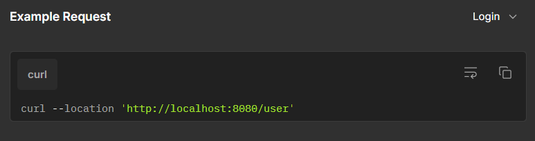

# Relatório Final do Projeto
## Projeto de Desenvolvimento Móvel

Trabalho realizado por:
- **Leonardo Nguyen** nº20230805
- **Martim Conceição** nº20231206
- **Rodrigo Freire** nº20230851

---

**Nome do projeto**: [SoundMarket](https://github.com/yaboyfreire/SoundMarket)  
**Link github**: [https://github.com/yaboyfreire/SoundMarket](https://github.com/yaboyfreire/SoundMarket)

---
## Divisão de tarefas

A SoundMarket é uma aplicação que tem como objetivo servir de marketplace e um biblioteca móvel para o utilizador. Nesta aplicação é possível procurar por álbuns, ver quais estão à venda, adicionar álbuns à coleção e ainda adicionar álbuns a uma lista de desejos. Com esta aplicação estamos a resolver um problema já existente no mercado, procura e compra de álbuns de forma intuitiva sem complicações.

Um dos objetivos principais do projeto era criar uma aplicação que conseguisse guardar os álbuns que o utilizador tem em sua casa, sendo eles em cd ou vinil e ao mesmo tempo conseguir colocar esses álbuns à venda e ter a possibilidade de comprar outros álbuns que o utilizador já estivesse à procura há algum tempo. A motivação inicial deste projeto foi a vontade de ter uma aplicação no telefone que fosse possível guardar e ver toda a coleção de música em formato físico que tinha em casa, rapidamente foi proposta a ideia da aplicação conseguir também realizar a compra e venda de álbuns.

O público alvo desta aplicação é toda a gente que tem uma coleção em formato físico e quer sempre estar a par do que tem estando onde estiver, mas por ser uma aplicação de fácil utilização pode-se dizer que a aplicação acaba por ser direcionada para toda a gente que gosta de música uma vez que as pessoas que queiram começar a colecionar ou só a comprar os seus álbuns favoritos podem utilizar a nossa aplicação, é também por isto que a nossa aplicação não tem nenhuma faixa etária alvo, podendo ser usada desde crianças até idosos 

Existem algumas aplicações com alguns conceitos semelhantes ao SoundMarket mas nenhuma delas tem todos os conceitos no mesmo sítio como a nossa. Algumas destas aplicações são o Discogs que é um marketplace já existente há muitos anos no mercado, que também permite guardar a música numa coleção e o que se destaca no Discogs é a vasta biblioteca de álbuns que a aplicação tem sendo muito fácil de se encontrar o que se procura o que se pode apontar como um ponto fraco desta aplicação é a dificuldade na compra e venda de artigos, mais na compra que não é nada intuitiva e certamente para alguém que queira comprar algo pela primeira vez na aplicação vai ter dificuldades. Outras aplicações que também se podem comparar com o SoundMarket são a vinted, o ebay e a amazon estas aplicações são todas marketplaces e o que elas tem todas em comum é a facilidade em comprar, sendo já muito mais fácil para quem compra pela primeira vez por outro lado a parte não tão boa destas aplicações é que por venderem tanto tipo de artigos acaba por ser bastante complicado de se encontrar o que se procura se for algo mais especifico. Por fim ainda existem todas as aplicações de lojas de música que acabam por ter uma grande variedade de artigos mas que não permitem guardar a nossa coleção.

A aplicação desenvolvida permite aos utilizadores procurarem os álbuns favoritos, ouvi-los no spotify bem como adiciona-los a uma coleção personalizada. A app proporciona uma experiencia intuitiva e personalizada, permitindo a gestão eficiente dos conteúdos musicais.

## Enquadramento das diversas UCs:

Programação de dispositivos móveis- Esta UC permitiu-nos fazer o desenvolvimento do design da aplicação e a implementação das APIs tanto a do Spotify como a nossa.

Programação orientada a objetos- Nesta UC desenvolvemos tudo o que era relacionado com a nossa API e o diagrama de classes do projeto

Bases de dados- Em bases de dados neste projetos fomos auxiliados na criação da nossa base de dados. Começando com o modelo entidade relação até à documentação da Base de dados 

Competências comunicacionais- A UC de competências comunicacionais ajudou-nos e bastante em todos os documentos que eram relacionados com o projeto, de apresentações, vídeos, powerpoints, a posters 

Matemática discreta-  

### Requisitos Técnicos:
 * Backend - No nosso backend foi utilizado Spring Boot v3.2.4 e Mysql
 * Frontend - no Frontend foi utilizado o Android Studio
 * APIs - No nosso projeto foram usadas a API do Spotify e a nossa própria API 

### Arquitetura da solução:
 * Arquitetura cliente-servidor- A app Android comunica com o backend desenvolvido em Spring Boot
 * Camadas:
   * Frontend- interface em kotlin
   * Backend -API REST em Spring Boot
   * Base de dados- MySQL para armazenamento de dados 

### Tecnologias usadas:
 * linguagens- Kotlin(Android Studio), Java(Api), MySQl(Base De Dados)
 * Frameworks- Spring Boot(Backend), Retrofit (APIs) 
 * API- Spotify Web API, SoundMarket API (A nossa API)
 * Ferramentas- Android Studio, Vscode, MySQl workbench, Postman (testes API), GitHub

## Caso de utilização do objeto “core” do projeto
## Personas

O caso aqui apresentado vai ser o processo de adicionar um álbum à coleção.
### Adicionar um álbum à coleção

1. O utilizador João Silva vai registar-se na aplicação.
2. Depois de se registar, faz login e é redirecionado para a home page.
3. Na home page, vai ter uma barra de pesquisa (search bar) para encontrar o álbum.
4. Ao encontrar e carregar no álbum, irá aparecer no topo da página a opção “add to collection”.
5. Depois de escolher o formato e a condição, o utilizador carrega no botão que diz "add to collection" e o álbum será adicionado à coleção.

---

### Ver um álbum na coleção

1. O utilizador faz login na aplicação
2. Na home page no canto superior direito, o utilizador vai encontrar três símbolos e vai carregar no primeiro
3. Quando estiver na página do perfil, vai encontrar algumas informações sobre o seu perfil e em baixo um carrossel com alguns dos álbuns disponiveis na sua coleção
4. Em cima desse carrossel ele vai ver um botão e carregar nesse botão
5. Esse botão leva o utilizador para outra página onde estão a ser mostrados todos os álbuns na coleção do utilizador 

---

### Colocar um álbum à venda

1. Na home page, em baixo no centro do ecrã, vai aparecer a opção “sell” e o utilizador João Silva vai carregar nesse botão.
2. O utilizador será levado para outra página onde irá encontrar uma barra de pesquisa (search bar) para procurar o nome do álbum (aparecerão apenas os álbuns que estão presentes na coleção do utilizador), um botão para escolher o formato, outro para escolher a condição do disco, um espaço para colocar o preço de venda e ainda uma caixa de texto para adicionar uma descrição ao produto.
3. Depois de preencher tudo, o João carrega no botão que diz “list item” e o item é colocado à venda.

---

## Diagrama de classes

---

## Guia de dados

---

## Dicionário de dados

---

## Planificação (Gráfico de Gantt)

As tarefas foram divididas de forma a garantir que os aspetos mais importantes estivessem concluídos a tempo da segunda entrega, com o restante a ser finalizado até a data final de entrega.

---

## Documentação Rest
Documentação da nossa API

Documentação da API do spotify

--- 
## Conclusão

Com o desenvolvimento da SoundMarket, o objetivo é criar uma plataforma simples e acessível que facilite a gestão, compra e venda de álbuns em formato físico. Pretendemos conectar uma comunidade de entusiastas de música, proporcionando uma experiência eficiente para colecionadores experientes e novos utilizadores.

---

## Bibliografia

- **Discogs**: [Discogs](https://www.discogs.com/?gad_source=1&gclid=CjwKCAjw1NK4BhAwEiwAVUHPUFWETK8eLn6yyI2wQMschx5hc1324ZFLm2U9KAnclErglRte2uR9SBoCfj4QAvD_BwE)
- **Clickup**: [Clickup](https://clickup.com/lp)
- **Poster**: [Canva](https://www.canva.com/)
- **Vídeo**: [Online Video Cutter](https://online-video-cutter.com/), [Promo.com](https://promo.com/)
- **Voice-over**: [ChatGPT](https://openai.com/index/chatgpt)
- **Mockup**: [Figma Mockups](https://www.figma.com/files/team/1423672219666502754/recents-and-sharing/recently-viewed?fuid=1423672217439376078)
